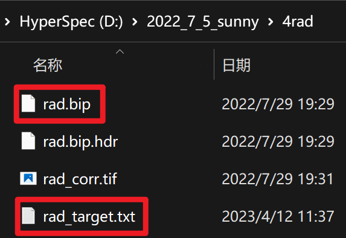
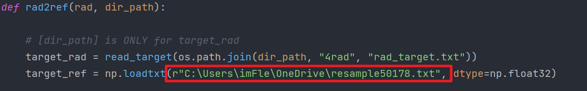
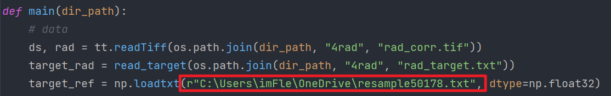

# AAC(Atmospheric Absorption Correction)
It's an atmospheric absorption correction program for Pika-L hyperspectral data.

这是为Pika-L高光谱数据编写的大气吸收矫正代码。

e-mail: flemyng1999@outlook.com

## 项目简介(Project introduction)

### 背景

针对推扫式无人机高光谱数据本人没有找到合适的软件处理，遂自己开发了这个小program。

### 主要思路

利用大气吸收波段的周围波段作为参考，将Pika-L传感器捕捉到的上行辐射（TOA radiance）进行简单的矫正（TOC radiance）。

由于传感器视角（17.6°）的原因画面**边缘**的上行辐射走过的路径会比**中心**的多走ΔL的距离，这段距离中存在大气中一些分子的“吸收”作用，所以在部分波段上边缘亮度会低于中心亮度，从而影响数据的使用。


然而这些被吸收波段的范围往往很窄（<20nm），因此可以利用其周围未被“吸收”的波段作为参考来矫正它们。

注意：本方法将辐射矫正到了中心部分的水平。

## 安装说明（Installation instructions）

### 1. 下载项目(Windows, MacOS and Linux)

```
git clone https://github.com/flemyng1999/AAC.git
cd AAC
```

### 2. 安装依赖

```
# （选择一）推荐
python -m pip install -r requirements.txt   

# （选择二）如果您使用anaconda，步骤也是类似的：
# （选择二.1）conda create -n ACC_venv python=3.11
# （选择二.2）conda activate ACC_venv
# （选择二.3）python -m pip install -r requirements.txt

# 备注：使用官方pip源或者阿里pip源，其他pip源（如一些大学的pip）有可能出问题，临时换源方法： 
# python -m pip install -r requirements.txt -i https://mirrors.aliyun.com/pypi/simple/
```

### 3. 运行

```
python multiprocess.py
```

##  :warning: 准备文件 :warning:

1. 设置你的第一层文件目录（例如：2022_7_5_sunny)，这是需要输入到multiprocess.py中的信息。在这个目录下设置三个子目录：4rad、5ref（子目录下可以空着）和ROI（可选，不设置ROI就不能运行multiprocess.py中的test()函数）。

   

1. 需要准备的数据：

   - 上行辐射高光谱数据rad.bip，放在4rad子目录下
   - 使用ENVI中ROI工具在上行辐射高光谱数据rad.bip中圈出靶标布上行辐射，导出为rad_target.txt，放在4rad子目录下
   - 
   - ROI目录下放置的数据是multiprocess.py文件中的test()函数读取用的，故名思意，就是ROI的蒙版，用来观察ROI的反射率。没有这个需求的话直接在multiprocess.py文件中注释掉test()即可
   - :warning: 还需要准备靶标布的反射率文件target_ref.txt，文件位置随意，但是需要将文件的绝对位置填入rad2ref.py文件中的rad2ref()以及main()函数的相应位置，如下图所示：
   - 
   - 
     此外，还需要注意靶标布反射率文件target_ref.txt的文件格式：两列数据，第一列为Pika-L的150个波段，第二列为靶标布的反射率。
